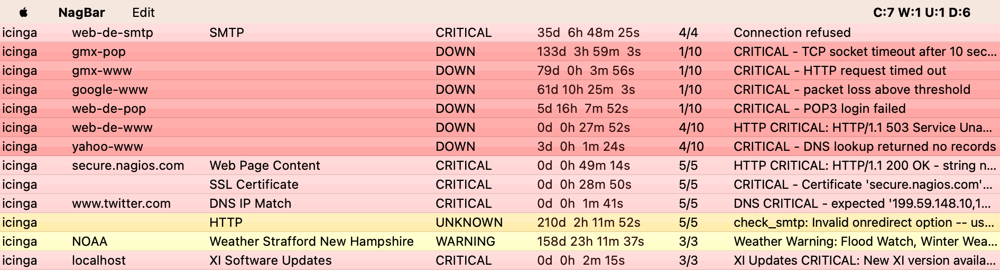

# NagBar

NagBar is a native macOS status bar client for Nagios-compatible monitoring
systems. It reads host and service status from Nagios, Icinga, Icinga 2, Thruk,
and Check_MK, then shows the current problem state from the menu bar.

This fork is a maintenance revival of the original project by Volen Davidov.



The first-run experience is backed by a loopback fake Icinga HTTP server and
the normal Icinga URL/client/parser path. There is no app-side `Demo Mode`
branch.

## Quick Start

Requirements:

- macOS 12.4 or newer
- Xcode

Open the workspace:

```sh
open NagBar.xcworkspace
```

Build and launch:

```sh
./script/build_and_run.sh --verify
```

Run the full test suite:

```sh
./script/build_and_run.sh --test
```

Run the live status-item smoke:

```sh
./script/build_and_run.sh --smoke
```

Create a local/private Release package:

```sh
./script/build_and_run.sh --package
```

## Project State

The canonical project status lives in [docs/PROJECT_STATUS.md](docs/PROJECT_STATUS.md).
As of 2026-07-01:

- `xcodebuild test -workspace NagBar.xcworkspace -scheme NagBar -destination 'platform=macOS'` passes with 324 tests.
- `xcodebuild build -workspace NagBar.xcworkspace -scheme NagBar -configuration Release -destination 'platform=macOS'` passes.
- `./script/build_and_run.sh --acceptance` passes full tests, Release build, and the live runtime smoke.
- `./script/build_and_run.sh --package` creates a local/private zip, checksum, and manifest under `dist/`.
- Public distribution still requires real Developer ID signing, notarization, and better coverage evidence.

## Documentation

- [docs/PROJECT_STATUS.md](docs/PROJECT_STATUS.md): current behavior, verification, and remaining gates
- [docs/DEVELOPER_GUIDE.md](docs/DEVELOPER_GUIDE.md): local workflow and testing priorities
- [docs/RELEASE.md](docs/RELEASE.md): packaging, signing, notarization, and release metadata
- [docs/USER_GUIDE.md](docs/USER_GUIDE.md): user-facing setup and workflow notes
- [docs/DEPENDENCIES.md](docs/DEPENDENCIES.md): dependency and license inventory
- [CHANGELOG.md](CHANGELOG.md): release-note source
- [docs/adr](docs/adr): architecture decisions

## Diagnostics

Maintainer triage logs:

```sh
./script/build_and_run.sh --logs
./script/build_and_run.sh --telemetry
```

Do not share credentials, tokens, private hostnames, private monitoring URLs,
or uncropped screenshots in public issues.

## Contributing

See [CONTRIBUTING.md](CONTRIBUTING.md).

## Security

See [SECURITY.md](SECURITY.md).

## License

NagBar is licensed under the Apache License 2.0. See [LICENSE](LICENSE).
Third-party asset notices are listed in [NOTICE](NOTICE).
